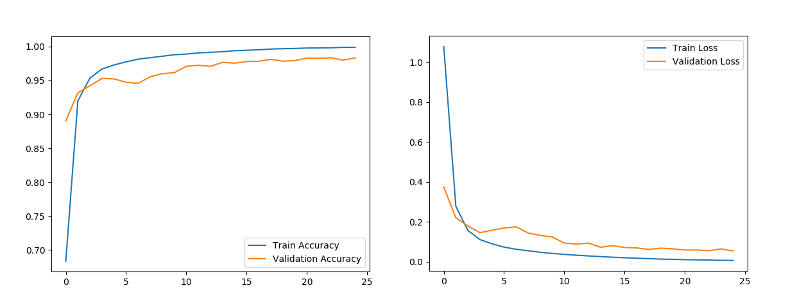

# Python-CNN-MNIST
</img>

<strong>Digit(MNIST) Classification using CNN model.</strong>

<strong>About Dataset</strong> 
The mnist_train.csv file contains the 60,000 training examples and labels. The mnist_test.csv contains 10,000 test examples and labels. Each row consists of 785 values: the first value is the label (a number from 0 to 9) and the remaining 784 values are the pixel values (a number from 0 to 255).

You can have this dataset from <a href="https://www.kaggle.com/oddrationale/mnist-in-csv">Kaggle</a>.

<strong>Results</strong>
</img>
